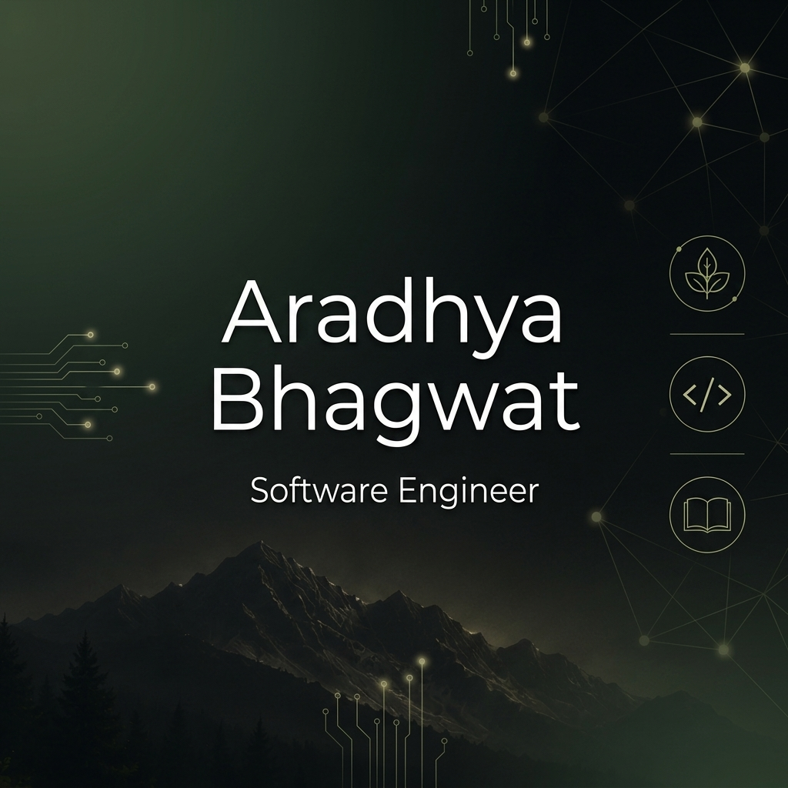

<!-- Premium Nature-Inspired GitHub Profile README -->

<h1 align="center">
  
</h1>

  <strong>🌿 Full-Stack Developer, iOS Engineer & QA Automation Specialist</strong>

  Crafting elegant, performant, and highly reliable digital experiences across web and mobile ecosystems.

  
  
  
  

---

### 🌿 About Me

Hi there! 👋 I am **Aradhya Bhagwat**, a multi-faceted **Software Engineer** specializing in full-stack web development, native iOS apps, and comprehensive QA testing automation. Grounded in a clean, nature-inspired design philosophy, I build high-performance software that is beautiful on the outside and structured on the inside.

- 🔭 **Current Focus**: Designing robust full-stack systems and creating immersive iOS mobile experiences.
- 📱 **Mobile Craftsmanship**: Building modern, intuitive native interfaces using SwiftUI and classic Storyboard architectures.
- 🧪 **Quality First**: Implementing end-to-end automated testing to guarantee product quality and stability.
- 🌱 **Learning & Exploration**: Keeping up with advanced cloud patterns and interactive UI technologies.

---

### 🛠️ Tech Stack & Ecosystem

I work across the stack to build, deploy, and verify modern software systems:

<table>
  <tr>
    <td width="50%" valign="top">
      <h3>💻 Programming & Web</h3>
      
      
      
      
      
    </td>
    <td width="50%" valign="top">
      <h3>📱 iOS Development</h3>
      
      
    </td>
  </tr>
  <tr>
    <td width="50%" valign="top">
      <h3>☁️ Backend & Database</h3>
      
      
      
    </td>
    <td width="50%" valign="top">
      <h3>🧪 QA & DevOps</h3>
      
      
    </td>
  </tr>
</table>

---

### 📊 GitHub Metrics & Insights

  
  

  

---

### 🐍 Contribution Activity Snake

*This grid updates automatically via GitHub Actions, tracing my development activity with an interactive snake:*

<picture>
  <source media="(prefers-color-scheme: dark)" srcset="https://raw.githubusercontent.com/Aradhya-Bhagwat/Aradhya-Bhagwat/output/github-contribution-grid-snake-nature.svg" />
  <source media="(prefers-color-scheme: light)" srcset="https://raw.githubusercontent.com/Aradhya-Bhagwat/Aradhya-Bhagwat/output/github-contribution-grid-snake.svg" />
  
</picture>

---

  <i>"In all things of nature, there is something of the marvelous." — Aristotle</i> 
  🌱 Driven by curiosity, dedicated to craft.

